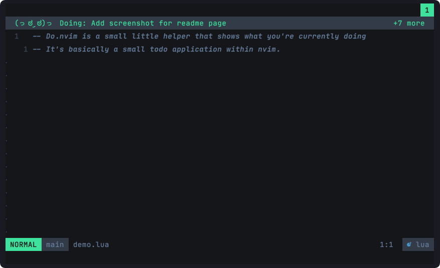
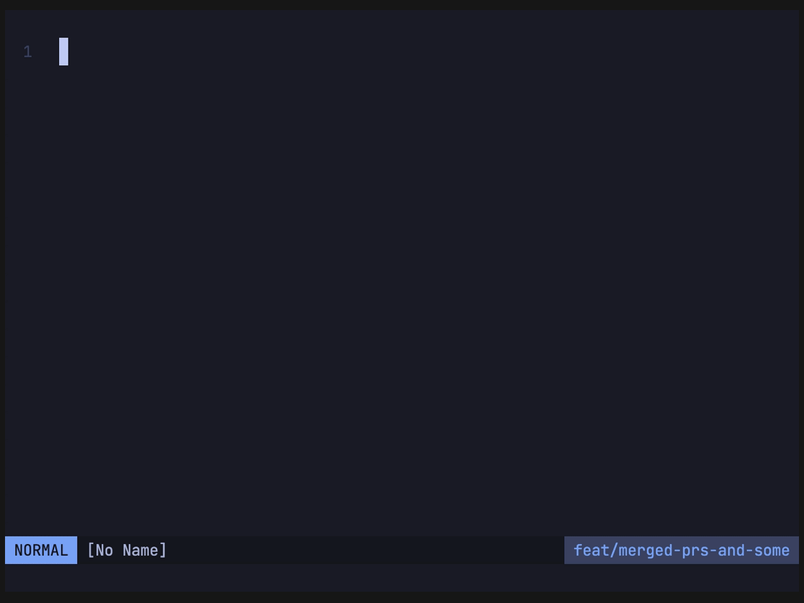

# Do.nvim

A tiny task manager within nvim that helps you stay on track.




## Introduction



## Rationale

While coding, we often need to do several things that depend on another.
And it's quite easy to loose track of what we initially set out to do in the first place, which is also know as [Yak Shaving](https://en.wiktionary.org/wiki/yak_shaving).
_Or_ we just have a list of tasks that we want to work off step by step.

This plugin provides a few simple commands to help you stay on track.

It manages a list of things and always shows you the first item.
It provides you with some commands to add things to it, without leaving context.
And it uses a simple, intuitive floating buffer to manage that list.

## Usage

-  `:Do` add a line to the end of the list.
-  `:Do!` add a line to the front of list.
-  `:Done!` remove the first line from the list.
-  `:DoEdit` edit the list in a floating window.
-  `:DoSave` create `.do_tasks` file in cwd. Will auto-sync afterwards.
-  `:DoToggle` toggle the display. Use with caution!

## Installation

 Requires Neovim 0.8.

```lua
-- use the package manager of your choice, eg. packer
use("https://github.com/nocksock/do.nvim")

-- setup wherever you do that in you config (eg init.lua)
require("do").setup({
  -- default options
  message_timeout = 2000, -- how long notifications are shown
  kaomoji_mode = 0, -- 0 kaomoji everywhere, 1 skip kaomoji in doing
  winbar = false,
  doing_prefix = "Doing: ",
  store = {
    auto_create_file = false, -- automatically create a .do_tasks when calling :Do
    file_name = ".do_tasks",
  }
})
```

## Winbar

This plugin felt best to me using the winbar - which is a new feature in
neovim 0.8. In order to use it, enable it:

```lua
require('do').setup({
  winbar = true
})
```

## Lualine

In case you'd rather use it in the statusline or tabbar, you can use the exposed
views to do so. For example with lualine:

```lua
require('lualine').setup {
  winbar = {
    lualine_a = {
      function()
        return require('do').view('active')
      end,
    },
  },
  inactive_winbar = {
    -- in order to prevent jumping of code in certain cursor positions this will
    -- (at the moment) show an empty line - but only if .view has contents.
    lualine_a = { require("do").view_inactive },
  },
}
```

## Events

This plugin exposes a custom event, for when a task is added or modified. You can use it like so:

```lua
vim.api.nvim_create_autocmd({ "User" }, {
   group = require("do.state").state.auGroupID,
   pattern = "TaskModified",
   desc = "This is called when a task is added or deleted",
   callback = function()
      vim.notify("A task has been modified")
   end,
})
```

## Development

### Run tests

Running tests requires [plenary.nvim][plenary] to be checked out in the parent directory of _this_ repository.
You can then run:

```bash
nvim --headless --noplugin -u tests/minimal.vim -c "PlenaryBustedDirectory tests/ {minimal_init = 'tests/minimal.vim'}"
```

Or if you want to run a single test file:

```bash
nvim --headless --noplugin -u tests/minimal.vim -c "PlenaryBustedDirectory tests/path_to_file.lua {minimal_init = 'tests/minimal.vim'}"
```

[nvim-lua-guide]: https://github.com/nanotee/nvim-lua-guide
[plenary]: https://github.com/nvim-lua/plenary.nvim
[neobundle]: https://github.com/Shougo/neobundle.vim
[vundle]: https://github.com/gmarik/vundle
[vim-plug]: https://github.com/junegunn/vim-plug
[pathogen]: https://github.com/tpope/vim-pathogen
[dein]: https://github.com/Shougo/dein.vim
